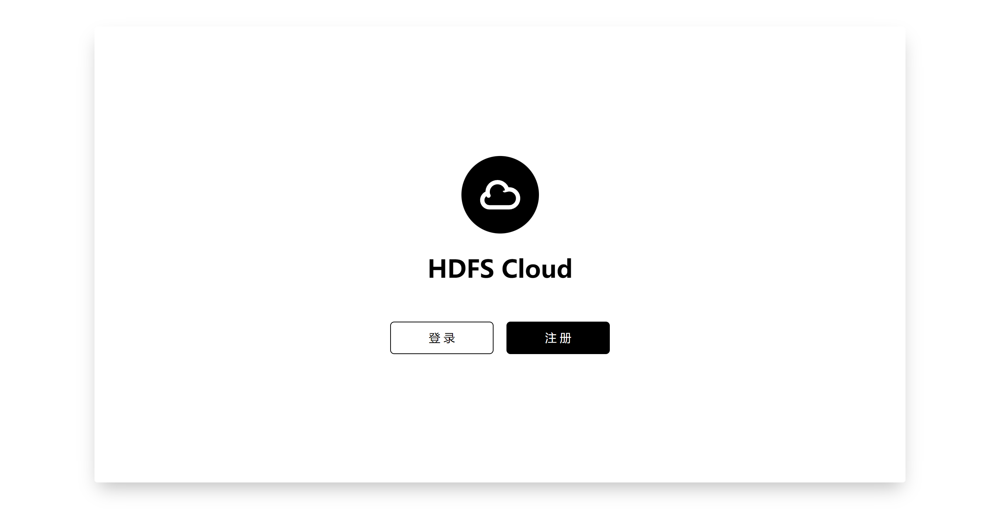
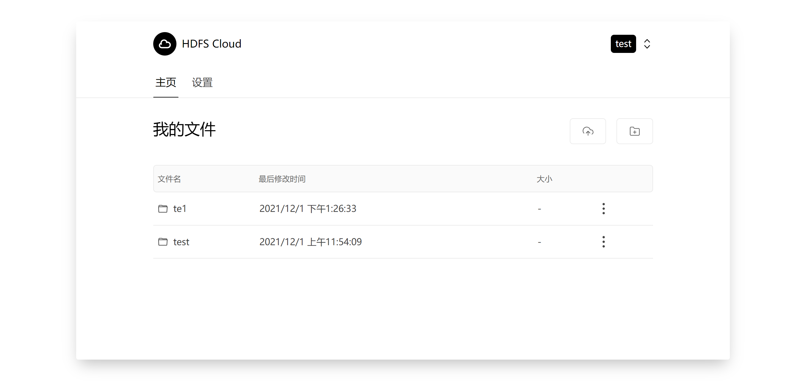

# HDFS Cloud

基于 Hadoop HDFS 的简单云盘系统。

用于学校课程作业。

## 功能

### 用户

- 用户注册、用户登录
- 用户个人信息修改
- 服务端生成 Token，用于客户端认证

### 云盘

- 每个用户不同的文件夹
- 创建新文件夹
- 文件查看、搜索、上传、下载、删除、重命名、移动

## 截图

应用首页

用户主页

 
## 技术栈

### 前端

 - [React](https://reactjs.org/)
 - [TailwindCSS](https://tailwindcss.com/)
 - [Geist UI](https://react.geist-ui.dev/)

### 后端
 
 - [Hadoop](https://hadoop.apache.org/)
 - [Spring Boot](https://spring.io/projects/spring-boot/)
 - [MySQL](https://www.mysql.com/)
 - [Mybatis](https://www.mybatis.org/)

